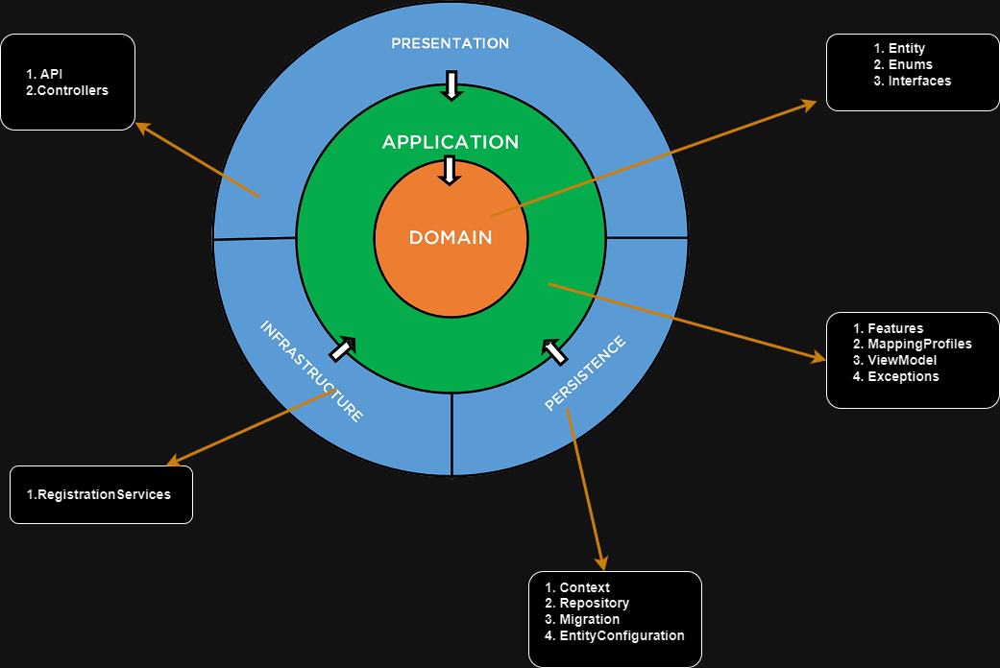
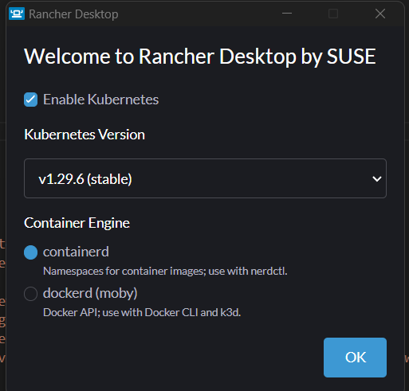
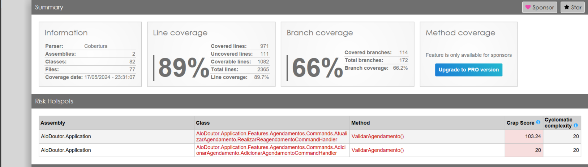
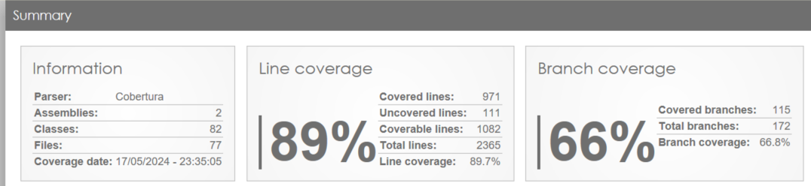
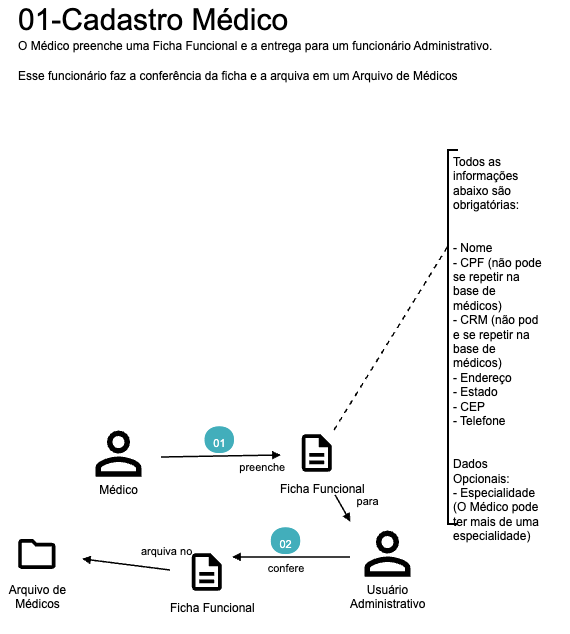
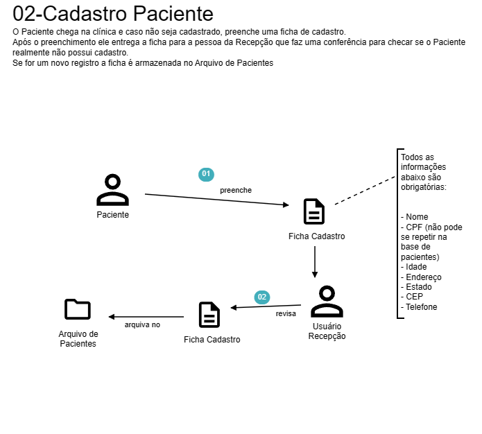
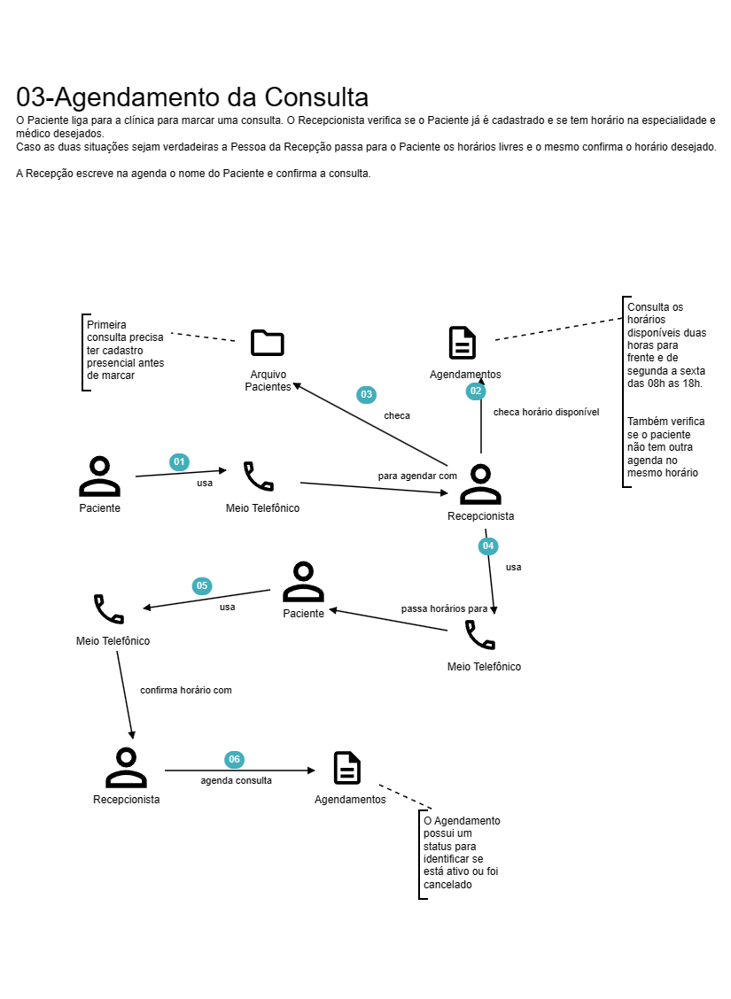
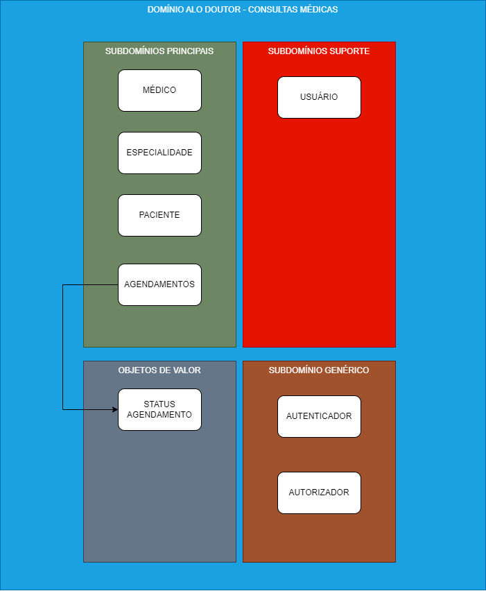
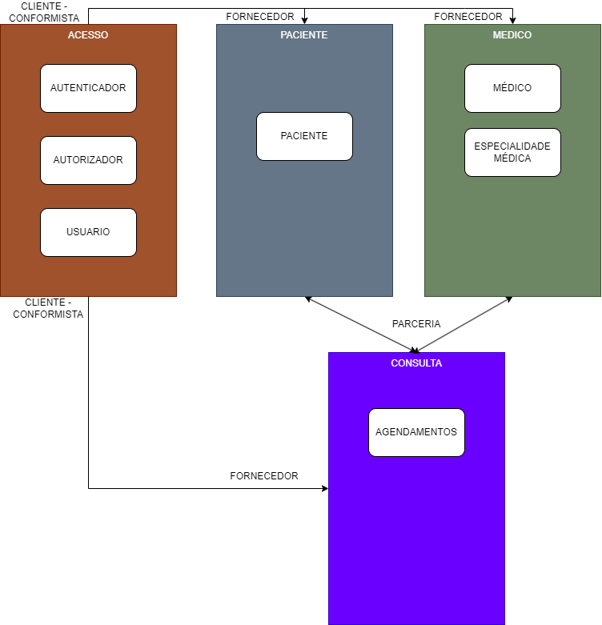

# Clínica Alô Doutor
## Índice
- [Clínica Alo Doutor](#clínica-alô-doutor)
    - [Sobre](#sobre) 
    - [Integrantes](#integrantes)  
    - [Tecnologias Utilizadas](#tecnologias-utilizadas)
    - [Solução](#solução)
        - [Como Executar o Projeto](#como-executar-o-projeto)    
        - [Como Executar o Projeto no Kubernetes](#como-executar-o-projeto-no-kubernetes)            
  - [Levantamento de Requisitos](#levantamento-de-requisitos)
    - [Histórico da Clínica](#histórico-da-clínica)
    - [DDD](#ddd)
        - [Domain Storytelling](#domain-storytelling)
        - [Domínios e Contextos Delimitados Identificados](#domínios-e-contextos-delimitados-identificados)
            - [Domínios](#domínios)
            - [Contextos Delimitados](#contextos-delimitados)
    - [Critérios de Aceite](#critérios-de-aceite)
    

## Sobre
Este projeto faz parte do trabalho de conclusão da primeira fase da POSTECH FIAP de Arquitetura de Sistemas .Net com Azure.

[voltar](#índice)

## Integrantes

| Nome | RM | GitHub
------------ | ------------- | -------------
Alex Jussiani Junior | 350671 | https://github.com/AlexJussiani
Erick Setti dos Santos | 351206 | https://github.com/ESettiCalculist
Fábio da Silva Pereira | 351053 | https://github.com/fbiopereira
Richard Kendy Tanaka| 351234 | https://github.com/RichardKT88

[voltar](#índice)

## Tecnologias Utilizadas

| Tecnologias | Uso
------------ | -------------
[C#](https://docs.microsoft.com/en-us/dotnet/csharp/) | Linguagem de Programação
[.NET](https://dotnet.microsoft.com/) | Framework web
[Entity Framework Core](https://docs.microsoft.com/en-us/ef/core/) | Biblioteca para persistência de Dados (ORM)
[Serilog](https://serilog.net/) | Captura de Logs
[Visual Studio 2022](https://visualstudio.microsoft.com/pt-br/) | Editor de Código
[Run Coverlet Report](https://github.com/the-dext/RunCoverletReport/blob/master/README.md) | Plugin do Visual Studio para analisar a cobertura de testes


[voltar](#índice)

## Solução
Desenvolvimento de uma Web Api em .NET Core com uma abordagem em Code First Migrations, e o Entity Framework para a persistência dos dados em um banco de dados Sql Server.

Na arquitetura de software utilizamos os conceitos da Clean Architecture e o projeto está estruturado de acordo com a imagem abaixo:




[voltar](#índice)

## Como Executar o Projeto

1- Preparando a base de dados

a - Instale o SQL Server 2022 Developer na sua máquina
        - https://www.microsoft.com/pt-br/sql-server/sql-server-downloads        
b - Instale o SQL Server Management Studio
        - https://learn.microsoft.com/en-us/sql/ssms/download-sql-server-management-studio-ssms?view=sql-server-ver16#download-ssms     
c - Crie uma base de dados com o nome AloDoutor
d - Crie um usuário com o login 'fiap' e senha 'Fi@p_2@24' e coloque o AloDoutor como banco default e de as devidas permissões de escrita nessa base de dados    

2- Clone este repositório

3- No terminal vá até a pasta `/AloDoutor` e execute o comando `dotnet restore` para restaurar as dependências do projeto

4- Execute o comando `dotnet run` na mesma pasta `/AloDoutor` para executar o projeto. As tabelas serão criadas automaticamente    
    - Acesse a documentação da API em:        
        -  `http://localhost:5001/swagger` 

[voltar](#índice)

## Como Executar o Projeto no Kubernetes

1- Preparando a base de dados

a - Instale o SQL Server 2022 Developer na sua máquina
        - https://www.microsoft.com/pt-br/sql-server/sql-server-downloads        
b - Instale o SQL Server Management Studio
        - https://learn.microsoft.com/en-us/sql/ssms/download-sql-server-management-studio-ssms?view=sql-server-ver16#download-ssms

2- Instalando o Kubernetes

a- Você pode utilizar qualquer instância de Kubernetes. A aqui utilizamos o Rancher Desktop:  
    https://rancherdesktop.io/

b- Durante a instalação utilize a opção abaixo, assim você não vai ter nenhum tipo de conflito caso tenha o Docker Desktop instalado:



3- Instalando o Ingress Controller

a- Para acessar a aplicação no Kubernetes sem port forward você precisará de um ingress controller. Para isso instale o Helm:
    https://helm.sh/

b- Com o helm instalado adicione o repositório do NGINX no mesmo com o seguinte comando:
``` 
helm repo add ingress-nginx https://kubernetes.github.io/ingress-nginx
helm repo update
helm install ingress-nginx-controller ingress-nginx/ingress-nginx
```

3- Executando a aplicação

a- Abra o arquivo (./k8s/alo-doutor.yml)

b- Altere a linha 22 para ter o IP correto da sua máquina

c- Salve o arquivo e no diretorio k8s digite:
```
kubectl apply -f .\alo-doutor.yml
```

d- Acesse a url http://alo-doutor.127.0.0.1.nip.io/swagger


[voltar](#índice)

## Testes

Foram criados dois projetos para os testes automatizados:

- AloDoutor.Application.unitTests
    - São testadas as entidades de domínio e casos de uso utilizando mocks

- AloDoutor.Api.IntegrationTests
    - Aqui testamos a API em si fazendo chamadas reais para a mesma e salvando as informações na base de dados

A cobertura alcançada está demonstrada pelas imagens abaixo:






## Levantamento de Requisitos

### Histórico da Clínica

A clínica Alô Doutor provê um serviço gratuito de consultas médicas para a população utilizando o sistema de atendimento presencial. 

A  clínica foi fundada em 2010 e desde então vem atendendo a população de forma gratuita. A clínica conta com médicos voluntários que atendem a população de segunda a sexta das 8h às 18h. 

Os médicos realizam consultas humanizadas de 1 hora e tem um intervalo de almoço das 12:00 as 14:00.

Atualmente todo o trabalho da clínica é feito de forma manual em fichas de papel, porém a clínica está buscando modernizar o seu sistema de marcação de consultas para melhorar a experiência do paciente e do médico.

Nesse momento foi solicitado que a informatização fosse realizada sem melhorias no processo atual.

[voltar](#índice)

### DDD
Para a modelagem da solução utilizamos o Domain Driven Design e fizemos uso do Domain Storytelling para transformar o conhecimento sobre o domínio em requisitos para o desenvolvimento da solução via um Software.

#### Domain Storytelling

O time de desenvolvimento conversou com o responsável administrativo pela clínica e identificou os seguintes pontos:


</br>
</br>

</br>
</br>


[voltar](#índice)


#### Domínios e Contextos Delimitados Identificados

##### Domínios



[voltar](#índice)

#### Contextos Delimitados



[voltar](#índice)

### Critérios de Aceite

- Cadastro de Médico 
    - As seguintes informações são obrigatórias no cadastro:
        - Nome
        - CPF
        - CRM
        - Telefone
        - Endereço
        - Estado
        - CEP
    - A especialidade é opcional
    - Um médico pode atender em mais de uma especialidade
    - Não podem haver dois médicos com o mesmo CRM
    - Não podem haver dois médicos com o mesmo CPF
    - O CPF deve ter 11 caracteres númericos
    - Nome precisa ter no mínimo 2 caracteres
    - Estado e endereço deve ter mais do que 2 caracteres
    

</br>

- Cadastro do Paciente
    - As seguintes informações são obrigatórias:
        - Nome
        - CPF
        - Idade
        - Telefone
        - Endereço
        - Estado
        - CEP

    - Não podem haver dois pacientes com o mesmo CPF
    - O CPF deve ter 11 caracteres númericos
<br>

- Marcação de Consultas
    - O Paciente e o Médico já devem estar cadastrados
    - Só podem ser considerados médicos que tem especialidade associada
    - As consultas só podem ser agendadas para os seguites dias:
        - Segunda-feira a Sexta-feira das 09h às 18h
    - Cada consulta tem duração de 1 hora obrigatoriamente
    - Não há necessidade de considerar feriados
    - As consultas devem ser agendadas com um mínimo de 2 horas de antecedência
    - O Paciente não pode marcar duas consultas no mesmo dia e horário
    - A consulta pode ser cancelada pelos usuários do sistema
    - Para reagendamentos e cancelamentos são necessários no mínimo 2 dias de antecedência (desconsiderando fins de semana)
   
<br>

[voltar](#índice)
