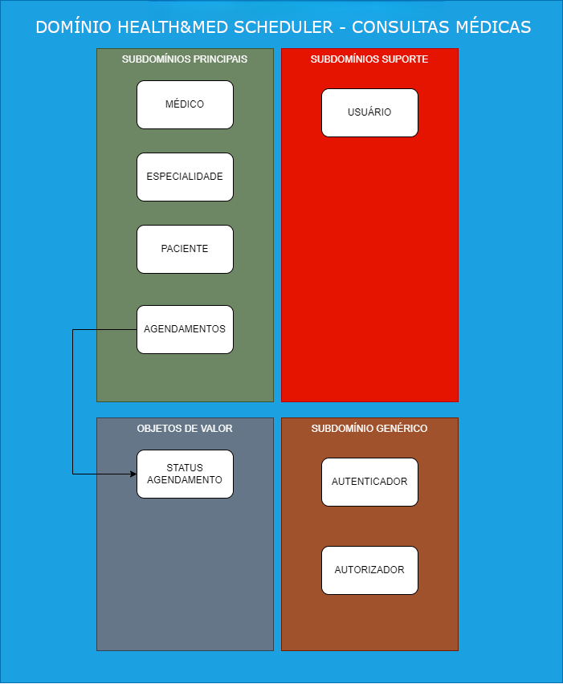
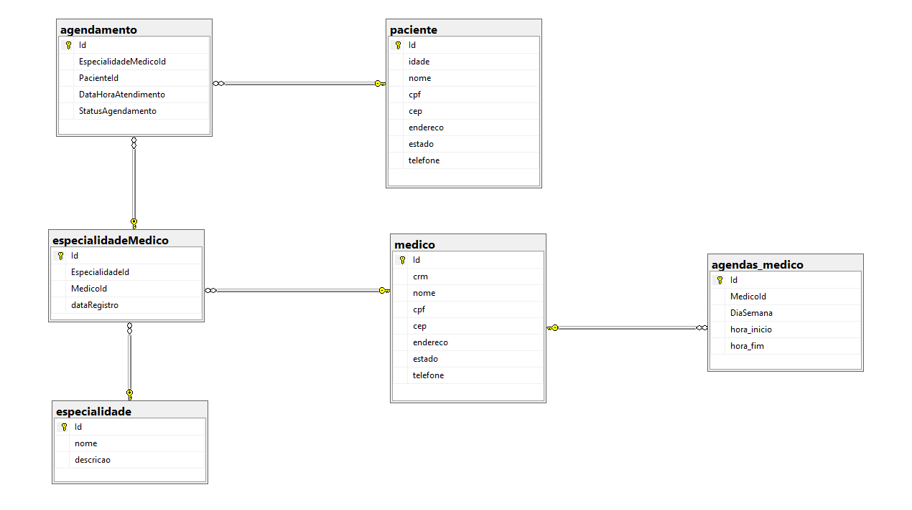

# Health&Med Scheduler
## Índice
- [Health\&Med Scheduler](#healthmed-scheduler)
  - [Índice](#índice)
  - [Sobre](#sobre)
  - [Integrantes](#integrantes)
  - [Tecnologias Utilizadas](#tecnologias-utilizadas)
  - [Solução](#solução)
  - [Como Executar o Projeto](#como-executar-o-projeto)
  - [Como Executar o Projeto no Kubernetes](#como-executar-o-projeto-no-kubernetes)
  - [Testes](#testes)
  - [Levantamento de Requisitos](#levantamento-de-requisitos)
    - [Histórico da Empresa](#histórico-da-empresa)
    - [DDD](#ddd)
      - [Domain Storytelling](#domain-storytelling)
      - [Domínios e Contextos Delimitados Identificados](#domínios-e-contextos-delimitados-identificados)
        - [Domínios](#domínios)
      - [Contextos Delimitados](#contextos-delimitados)
    - [Requisitos Funcionais](#requisitos-funcionais)
    - [Requisitos Não Funcionais](#requisitos-não-funcionais)
    - [Diagrama da Base de Dados](#diagrama-da-base-de-dados)
    

## Sobre
Este projeto faz parte do trabalho de conclusão do Hackathon da POSTECH FIAP de Arquitetura de Sistemas .Net com Azure.

[voltar](#índice)

## Integrantes

| Nome                   | RM     | GitHub                             |
| ---------------------- | ------ | ---------------------------------- |
| Alex Jussiani Junior   | 350671 | https://github.com/AlexJussiani    |
| Erick Setti dos Santos | 351206 | https://github.com/ESettiCalculist |
| Fábio da Silva Pereira | 351053 | https://github.com/fbiopereira     |
| Richard Kendy Tanaka   | 351234 | https://github.com/RichardKT88     |

[voltar](#índice)

## Tecnologias Utilizadas

| Tecnologias                                                                                | Uso                                                         |
| ------------------------------------------------------------------------------------------ | ----------------------------------------------------------- |
| [C#](https://docs.microsoft.com/en-us/dotnet/csharp/)                                      | Linguagem de Programação                                    |
| [.NET](https://dotnet.microsoft.com/)                                                      | Framework web                                               |
| [Entity Framework Core](https://docs.microsoft.com/en-us/ef/core/)                         | Biblioteca para persistência de Dados (ORM)                 |
| [Serilog](https://serilog.net/)                                                            | Captura de Logs                                             |
| [Visual Studio 2022](https://visualstudio.microsoft.com/pt-br/)                            | Editor de Código                                            |
| [Run Coverlet Report](https://github.com/the-dext/RunCoverletReport/blob/master/README.md) | Plugin do Visual Studio para analisar a cobertura de testes |


[voltar](#índice)

## Solução
Desenvolvimento de uma Web Api em .NET Core com uma abordagem em Code First Migrations, e o Entity Framework para a persistência dos dados em um banco de dados Sql Server.

Na arquitetura de software utilizamos os conceitos da Clean Architecture e o projeto está estruturado de acordo com a imagem abaixo:


[voltar](#índice)

## Como Executar o Projeto

1- Preparando a base de dados

a - Instale o SQL Server 2022 Developer na sua máquina
        - https://www.microsoft.com/pt-br/sql-server/sql-server-downloads        
b - Instale o SQL Server Management Studio
        - https://learn.microsoft.com/en-us/sql/ssms/download-sql-server-management-studio-ssms?view=sql-server-ver16#download-ssms     
c - Crie uma base de dados com o nome HealthMedScheduler
d - Crie um usuário com o login 'fiap' e senha 'Fi@p_2@24' e coloque o HealthMedScheduler como banco default e de as devidas permissões de escrita nessa base de dados    

2- Clone este repositório

3- No terminal vá até a pasta `/Health-Med-Scheduler` e execute o comando `dotnet restore` para restaurar as dependências do projeto

4- Execute o comando `dotnet run` na mesma pasta `/Health-Med-Scheduler` para executar o projeto. As tabelas serão criadas automaticamente    
    - Acesse a documentação da API em:        
        -  `http://localhost:5001/swagger` 

[voltar](#índice)

## Como Executar o Projeto no Kubernetes

1- Preparando a base de dados

a - Instale o SQL Server 2022 Developer na sua máquina
        - https://www.microsoft.com/pt-br/sql-server/sql-server-downloads        
b - Instale o SQL Server Management Studio
        - https://learn.microsoft.com/en-us/sql/ssms/download-sql-server-management-studio-ssms?view=sql-server-ver16#download-ssms

2- Instalando o Kubernetes

a- Você pode utilizar qualquer instância de Kubernetes. A aqui utilizamos o Rancher Desktop:  
    https://rancherdesktop.io/

b- Durante a instalação utilize a opção abaixo, assim você não vai ter nenhum tipo de conflito caso tenha o Docker Desktop instalado:


3- Instalando o Ingress Controller

a- Para acessar a aplicação no Kubernetes sem port forward você precisará de um ingress controller. Para isso instale o Helm:
    https://helm.sh/

b- Com o helm instalado adicione o repositório do NGINX no mesmo com o seguinte comando:
``` 
helm repo add ingress-nginx https://kubernetes.github.io/ingress-nginx
helm repo update
helm install ingress-nginx-controller ingress-nginx/ingress-nginx
```

3- Executando a aplicação

a- Abra o arquivo (./k8s/health-med.yml)

b- Altere a linha 22 para ter o IP correto da sua máquina

c- Salve o arquivo e no diretorio k8s digite:
```
kubectl apply -f .\health-med.yml
```

d- Acesse a url http://health-med.127.0.0.1.nip.io/swagger


[voltar](#índice)

## Testes

Foram criados dois projetos para os testes automatizados:

- HealthMedScheduler.Application.unitTests
    - São testadas as entidades de domínio e casos de uso utilizando mocks

- HealthMedScheduler.Api.IntegrationTests
    - Aqui testamos a API em si fazendo chamadas reais para a mesma e salvando as informações na base de dados

A cobertura alcançada está demonstrada pelas imagens abaixo:


## Levantamento de Requisitos

### Histórico da Empresa

A Health&Med é uma Operadora de Saúde que tem como objetivo digitalizar seus processos e operação. O principal gargalo da empresa é o Agendamento de Consultas Médicas, que atualmente ocorre exclusivamente através de ligações para a central de atendimento da empresa. 
Recentemente, a empresa recebeu um aporte e decidiu investir no desenvolvimento de um sistema proprietário, visando proporcionar um processo de Agendamentos de Consultas Médicas 100% digital e mais ágil.
Para viabilizar o desenvolvimento de um sistema que esteja em conformidade com as melhores práticas de desenvolvimento, a Health&Med contratou os alunos do curso de Pós Graduação .NET da FIAP para fazer a análise do projeto e desenvolver o MVP da solução.

[voltar](#índice)

### DDD
Para a modelagem da solução utilizamos o Domain Driven Design e fizemos uso do Domain Storytelling para transformar o conhecimento sobre o domínio em requisitos para o desenvolvimento da solução via um Software.

#### Domain Storytelling

O time de desenvolvimento conversou com o responsável administrativo pela operadora e identificou os seguintes pontos:


</br>
</br>

</br>
</br>


[voltar](#índice)


#### Domínios e Contextos Delimitados Identificados

##### Domínios



[voltar](#índice)

#### Contextos Delimitados


[voltar](#índice)

### Requisitos Funcionais

1. Cadastro do Usuário (Médico)
   - O médico deverá poder se cadastrar, preenchendo os campos obrigatórios: Nome, CPF, Número CRM, E-mail e Senha.  
2. Autenticação do Usuário (Médico)
   - O sistema deve permitir que o médico faça login usando o E-mail e uma Senha.  
3. Cadastro/Edição de Horários Disponíveis (Médico)
   - O sistema deve permitir que o médico faça o Cadastro e Edição de seus horários disponíveis para agendamento de consultas.
4. Cadastro do Usuário (Paciente)
    - O paciente poderá se cadastrar preenchendo os campos: Nome, CPF, Email e Senha.
5. Autenticação do Usuário (Paciente)
   - O sistema deve permitir que o paciente faça login usando um E-mail e Senha.
6. Busca por Médicos (Paciente)
   - O sistema deve permitir que o paciente visualize a listagem dos médicos disponíveis.
7. Agendamento de Consultas (Paciente)
   - Após selecionar o médico, o paciente deve poder visualizar a agenda do médico com os horários disponíveis e efetuar o agendamento.
8. Notificação de consulta marcada (Médico)
   - Após o agendamento, feito pelo usuário Paciente, o médico deverá receber um e-mail contendo:
     - Título do e-mail: ˮHealth&Med - Nova consulta agendadaˮ
     - Corpo do e-mail: ˮOlá, Dr. {nome_do_médico}! Você tem uma nova consulta marcada! Paciente: {nome_do_paciente}. Data e horário: {data} às {horário_agendado}.ˮ


### Requisitos Não Funcionais

1. Concorrência de Agendamentos
   - O sistema deve ser capaz de suportar múltiplos acessos simultâneos e garantir que apenas uma marcação de consulta seja permitida para um determinado horário.
2. Validação de Conflito de Horários
   - O sistema deve validar a disponibilidade do horário selecionado em tempo real, assegurando que não haja sobreposição de horários para consultas agendadas.
   
### Diagrama da Base de Dados


[voltar](#índice)
