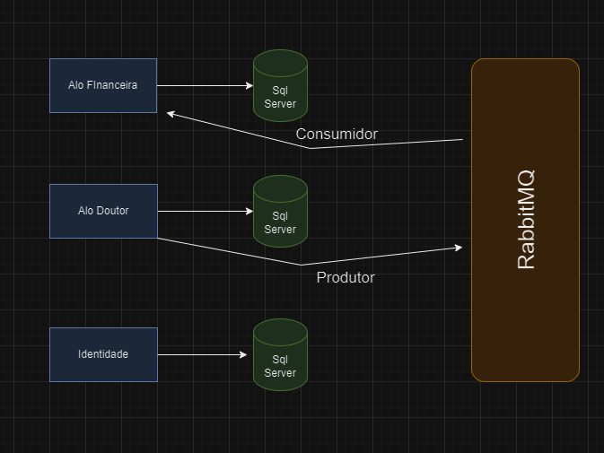
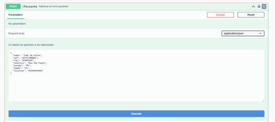
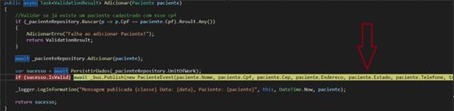
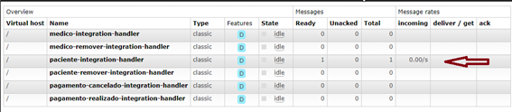
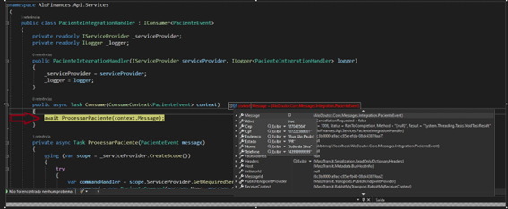

# Clínica Alô Doutor
## Índice
- [Clínica Alô Doutor](#clínica-alô-doutor)
  - [Índice](#índice)
  - [Sobre](#sobre)
  - [Integrantes](#integrantes)
  - [Tecnologias Utilizadas](#tecnologias-utilizadas)
  - [Solução](#solução)
  - [Como Executar o Projeto](#como-executar-o-projeto)
    - [Execução local](#execução-local)
    - [Autenticação e autorização](#autenticação-e-autorização)
    - [Como funciona a comunicação entre os microsserviços](#como-funciona-a-comunicação-entre-os-microsserviços)
      - [Fluxograma Mensageria](#fluxograma-mensageria)
      - [API AloDoutor](#api-alodoutor)
      - [API AloFinances](#api-alofinances)
    - [Exemplo: Cadastro de Paciente](#exemplo-cadastro-de-paciente)
  - [Levantamento de Requisitos](#levantamento-de-requisitos)
    - [Histórico da Clínica](#histórico-da-clínica)
    - [DDD](#ddd)
      - [Domain Storytelling](#domain-storytelling)
      - [Domínios e Contextos Delimitados Identificados](#domínios-e-contextos-delimitados-identificados)
        - [Domínios](#domínios)
      - [Contextos Delimitados](#contextos-delimitados)
    - [Critérios de Aceite](#critérios-de-aceite)
    

## Sobre
Este projeto faz parte do trabalho de conclusão da terceira fase da POSTECH FIAP de Arquitetura de Sistemas .Net com Azure.

[voltar](#índice)

## Integrantes

| Nome                   | RM     | GitHub                             |
| ---------------------- | ------ | ---------------------------------- |
| Alex Jussiani Junior   | 350671 | https://github.com/AlexJussiani    |
| Erick Setti dos Santos | 351206 | https://github.com/ESettiCalculist |
| Fábio da Silva Pereira | 351053 | https://github.com/fbiopereira     |
| Richard Kendy Tanaka   | 351234 | https://github.com/RichardKT88     |

[voltar](#índice)

## Tecnologias Utilizadas

| Tecnologias                                                        | Uso                                         |
| ------------------------------------------------------------------ | ------------------------------------------- |
| [C#](https://docs.microsoft.com/en-us/dotnet/csharp/)              | Linguagem de Programação                    |
| [.NET](https://dotnet.microsoft.com/)                              | Framework web                               |
| [Entity Framework Core](https://docs.microsoft.com/en-us/ef/core/) | Biblioteca para persistência de Dados (ORM) |
| [Serilog](https://serilog.net/)                                    | Captura de Logs                             |
| [Visual Studio 2022](https://visualstudio.microsoft.com/pt-br/)    | Editor de Código                            |
| [Docker](https://www.docker.com/)                                  | Criação de Containers                       |
| [RabbiMQ](https://www.rabbitmq.com/)                               | Message Broker                              |
| [Mass Transit](https://masstransit.io/)                            | Software de Barramento                      |

[voltar](#índice)

## Solução
Foi criada uma Web Api em .NET Core 7 para gerenciar a parte financeira da aplicação de agendamento de consultas. Ela funciona da seguinte maneira. Qualquer ação no serviço AloDoutor em médicos, pacientes e agendamento é disparado uma mensagem para o RabbitMQ e o serviço financeiro fica escutando esse tipo de mensagem para conseguir gerenciar a parte de contas a receber.

[voltar](#índice)

## Como Executar o Projeto

### Execução local

1. Clone o repositório
2.	No terminal execute o seguinte comando para rodar o RabbitMQ no Docker
    - `docker pull masstransit/rabbitmq` 
    - `docker run -p 15672:15672 -p 5672:5672 masstransit/rabbitmq`
    - Usuário e senha padrão:
        - Usuário: **guest**
        - Senha: **guest**

1. No terminal vá até a pasta `/AloDoutor` e execute o comando `dotnet restore` para restaurar as dependências do projeto

2. Atualização da base de dados (este passo não é obrigatório pois a aplicação foi configurada para executar as migrations automaticamente, mas caso queira executar manualmente siga os passos abaixo):
    - Execute o comando `dotnet tool install --global dotnet-ef`
    - Vá para a pasta `/AloDoutor.Api`
    - Execute o comando `dotnet ef database update`
    - Vá para a pasta `/Identidade.Api`
    - Execute novamente o comando `dotnet ef database update`
    - Vá para a pasta `/AloFinances.Api`
    - Execute novamente o comando `dotnet ef database update`

3. Executando os projetos:
    - Volte na pasta `/AloDoutor.Api` execute o comando `dotnet run` para executar o projeto
    - Abra um novo terminal na pasta `/Identidade.Api` execute o comando `dotnet run` para executar o projeto
    - Abra o navegador e acesse:
        -  `http://localhost:5002/swagger/index.html` para a API de autenticação e autorização
        -  `http://localhost:5001/swagger/index.html` para a API AloDoutor 
        -  `http://localhost:7174/swagger/index.html` para a API de finanças

[voltar](#índice)

### Autenticação e autorização

- A aplicação cria um usuário padrão para testes com as seguintes credenciais:
    - Email (login): **postechdotnet@gmail.com**
    - Senha: **Pos@123**
    - Perfil: **Administrador**

- Com esse usuário é possível cadastrar novos usuários e realizar o login para acessar as funcionalidades do sistema.
- Usuários não administradores não tem acesso a funcionalidades de cadastro de usuários. Somente as funcionalidades da API AloDoutor
- Como fazer a autenticção:
    - A autenticação é na API de Autenticação e Autorização
    - Caso o login seja feito com sucesso onde um token JWT será gerado
    - Este token deve ser utilizado na API AloDoutor para autorização dos endpoints e o token gerado é utilizado para autorizar o acesso as funcionalidades do sistema.

[voltar](#índice)

### Como funciona a comunicação entre os microsserviços
#### Fluxograma Mensageria

#### API AloDoutor
1) **Paciente**
    1. Quando é realizado um cadastro ou Atualização de um paciente é disparado uma mensagem na fila do RabbitMQ do tipo *PacienteEvent*
	2. Quando algum paciente é removido, é disparado uma mensagem na fila do RabbitMQ do tipo *PacienteRemovidoEvent*
2) **Médico**
	1. Quando é realizado um cadastro ou Atualização de um médico é disparado uma mensagem na fila do RabbitMQ do tipo *MedicoEvent*
	2. Quando algum médico é removido, é disparado uma mensagem na fila do RabbitMQ do tipo *MedicoRemovidoEvent*	
3) **Agendamento**
	1. Quando é realizado um reagendamento ou cadastro de um agendamento é disparado uma mensagem na fila do RabbitMQ do tipo *AgendamentoRealizadoEvent*
	2. Quando é realizado um cancelamento de um agendamento é disparado uma mensagem na fila do RabbitMQ do tipo *AgendamentoCanceladoEvent*.

	
#### API AloFinances
É uma api desenvolvida para gerencias as contas a receber com base nos agendamentos realizados na API Alo Doutor. Ela fica escutando as mensagens na fila do RabbitMQ dos tipos que vou destacar em seguida
- *MedicoEvent*: Esse tipo de mensagem recebida basicamente serve para cadastrar ou atualizar um médico.
- *MedicoRemovidoEvent*: Esse tipo de mensagem recebida é utilizado para remover um médico.
- *PacienteEvent*:  Esse tipo de mensagem recebida basicamente serve para cadastrar ou atualizar um Paciente.
- *PacienteRemovidoEvent*: Esse tipo de mensagem recebida é utilizado para remover um Paciente.
- *AgendamentoRealizadoEvent*: Esse tipo de mensagem recebida basicamente serve para cadastrar ou atualizar uma conta.
- *AgendamentoCanceladoEvent*: Esse tipo de mensagem recebida é utilizado para cancelar uma conta.

### Exemplo: Cadastro de Paciente

Segue abaixo um exemplo da API AloDoutor produzindo uma mensagem e publicando, o RabbitMQ recebe e é consumida pela API AloFinances.

Quando é realizado um cadastro de paciente na API AloDoutor, vide imagem abaixo.

É realizado a persistência dos dados na api AloDoutor, e caso o cadastro tenha sido realizado com sucesso é disparado uma mensagem do tipo “PacienteEvent”, como mostra a imagem abaixo: 

Mensagem disparada na fila do RabbitMQ aguardando ser consumida:

Do outro lado temos outro sistema que fica “escutando” essa fila. Quando executamos o projeto “Alo Finances” ela vai consumir essa mensagem como mostra a imagem abaixo: 

E posteriormente realizado toda a validação para depois ser persistido na base AloFinances.
Todo esse processo ocorre da mesma maneira para Médicos e Agendamentos, onde cada um obedece a sua regra de negócio.

## Levantamento de Requisitos

### Histórico da Clínica

A clínica Alô Doutor provê um serviço gratuito de consultas médicas para a população utilizando o sistema de atendimento presencial. 

A  clínica foi fundada em 2010 e desde então vem atendendo a população de forma gratuita. A clínica conta com médicos voluntários que atendem a população de segunda a sexta das 8h às 18h. 

Os médicos realizam consultas humanizadas de 1 hora e tem um intervalo de almoço das 12:00 as 14:00.

Atualmente todo o trabalho da clínica é feito de forma manual em fichas de papel, porém a clínica está buscando modernizar o seu sistema de marcação de consultas para melhorar a experiência do paciente e do médico.

Nesse momento foi solicitado que a informatização fosse realizada sem melhorias no processo atual.

[voltar](#índice)

### DDD
Para a modelagem da solução utilizamos o Domain Driven Design e fizemos uso do Domain Storytelling para transformar o conhecimento sobre o domínio em requisitos para o desenvolvimento da solução via um Software.

#### Domain Storytelling

O time de desenvolvimento conversou com o responsável administrativo pela clínica e identificou os seguintes pontos:

 
 

 
 

[voltar](#índice)

#### Domínios e Contextos Delimitados Identificados

##### Domínios

[voltar](#índice)

#### Contextos Delimitados

[voltar](#índice)

### Critérios de Aceite

- Cadastro de Médico 
    - As seguintes informações são obrigatórias no cadastro:
        - Nome
        - CPF
        - CRM
        - Telefone
        - Endereço
        - Estado
        - CEP
    - A especialidade é opcional
    - Um médico pode atender em mais de uma especialidade
    - Não podem haver dois médicos com o mesmo CRM
    - Não podem haver dois médicos com o mesmo CPF
    - O CPF deve ter 11 caracteres númericos
    - Nome precisa ter no mínimo 2 caracteres
    - Estado e endereço deve ter mais do que 2 caracteres
    

 

- Cadastro do Paciente
    - As seguintes informações são obrigatórias:
        - Nome
        - CPF
        - Idade
        - Telefone
        - Endereço
        - Estado
        - CEP

    - Não podem haver dois pacientes com o mesmo CPF
    - O CPF deve ter 11 caracteres númericos
 

- Marcação de Consultas
    - O Paciente e o Médico já devem estar cadastrados
    - Só podem ser considerados médicos que tem especialidade associada
    - As consultas só podem ser agendadas para os seguites dias:
        - Segunda-feira a Sexta-feira das 09h às 18h
    - Cada consulta tem duração de 1 hora obrigatoriamente
    - Não há necessidade de considerar feriados
    - As consultas devem ser agendadas com um mínimo de 2 horas de antecedência
    - O Paciente não pode marcar duas consultas no mesmo dia e horário
    - A consulta pode ser cancelada pelos usuários do sistema
    - Para reagendamentos e cancelamentos são necessários no mínimo 2 dias de antecedência (desconsiderando fins de semana)
   
 

- Controle de Acesso
    - Todas as funcionalizadas devem ser executadas por um Usuário previamente cadastrado no sistema
    - O sistema deve ter 2 tipos de usuário:
        - Administrador: Acesso a cadastro de usuário e as funcionalidades do Alô Doutor
        - Operador: Acesso somente as funcionalidades do Alô Doutor
    - Se o usuário não estiver autenticado, ele não pode acessar as funcionalidades do sistema
    - O usuário cadastrado contará com nome, cpf e email. Todos são obrigatórios, sendo que:
        - O Email deve ser válido
        - A Senha deve ter o mínimo de 6 caracteres
            - A senha deve ser composta por 1 carater não alfanúmerico, 1 digito (0-9), 1 letra caixa baixa (a-z), 1 letra caixa alta (A-Z)  
            - No momento do cadastro precisa ser inserida 2 vezes

[voltar](#índice)
